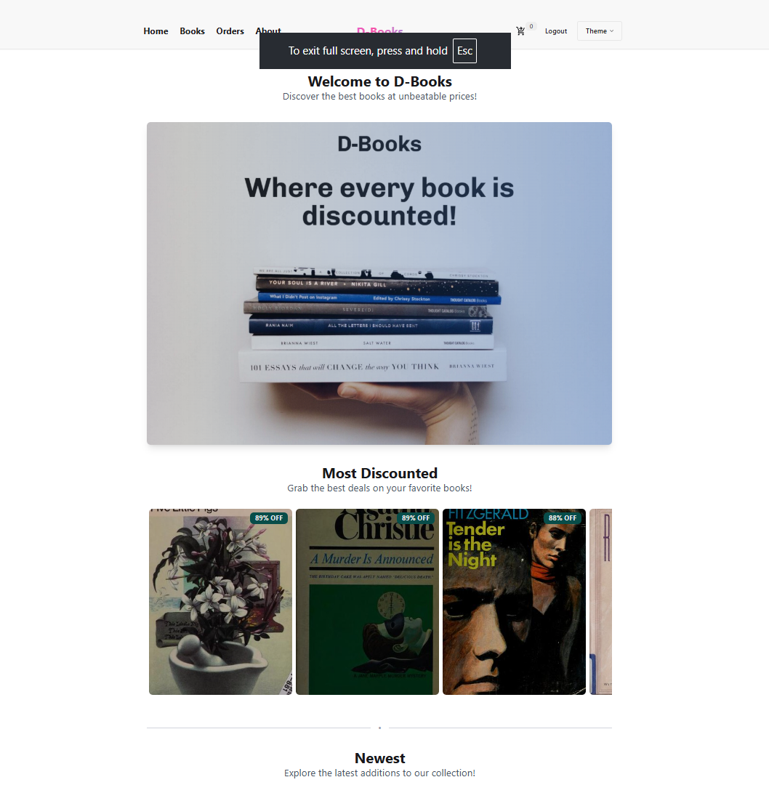

# D-Books: Fullstack Online Book Store

<p align="center">
  
</p>

## 📚 Introduction
D-Books is a fullstack web application for an online bookstore, built to showcase modern web development skills. Users can browse, search, and purchase books, with secure authentication, admin management, and Stripe-powered payments. This project is for learning and portfolio purposes only.

---

## 🛠️ Tech Stack
- **Frontend:** React, Redux, TypeScript, TailwindCSS, DaisyUI, Vite
- **Backend:** Node.js, Express.js, TypeScript
- **Database:** MongoDB (Mongoose ODM)
- **Authentication:** JWT (jsonwebtoken), bcryptjs, http-only cookies
- **Validation:** express-validator
- **Payments:** Stripe
- **Deployment:** Render.com (separate frontend & backend services)

<p align="center">
  
  
  
  
  
  
  
  
</p>

---

## ✨ Features
- User registration, login, and JWT authentication (token stored in http-only cookie)
- Admin and normal user roles
- Browse, search, and filter books
- Shopping cart and order management
- Secure Stripe payment integration
- Admin dashboard for managing books and orders
- Input validation with express-validator
- Responsive UI with TailwindCSS & DaisyUI
- Client-side routing (React Router)
- Production-ready CORS, environment variables, and error handling

---

## 🌎 Live Demo
- Visit the website: [D-Books on Render](https://d-books.onrender.com/)

---

## 🖼️ Screenshots
- **Home Page:**
  
- **Books Page:**
  
- **Cart & Checkout:**
  
- **Stripe Payment:**
  
- **Admin Dashboard:**
  

---

## 🚀 Getting Started

### Prerequisites
- Node.js (see `.node-version` for recommended version)
- MongoDB database (local or cloud)
- Stripe account (for payments)

### 1. Clone the repository
```bash
git clone https://github.com/yourusername/d-books.git
cd d-books
```

### 2. Setup environment variables
- Copy `.env.example` (if provided) or create `.env` files in both `backend/` and `frontend/`.
- Fill in all required variables (see code comments and Render deployment section below).

### 3. Install dependencies
```bash
cd backend
npm install
cd ../frontend
npm install
```

### 4. Run locally
- **Backend:**
  ```bash
  cd backend
  npm run dev
  ```
- **Frontend:**
  ```bash
  cd frontend
  npm run dev
  ```
- Visit the frontend URL (usually `http://localhost:5173`)

### 5. Build for production
- **Backend:**
  ```bash
  cd backend
  npm run build
  ```
- **Frontend:**
  ```bash
  cd frontend
  npm run build
  ```

---

## 🌐 Deployment (Render.com)
- Deploy backend and frontend as separate services on Render.
- Set all environment variables in the Render dashboard (see `.env` files for required keys).
- For client-side routing, add a rewrite rule in the Render dashboard:  
  `/api/*` → backend, all other routes → `index.html` (see Render docs)
- Stripe webhook endpoint must match your deployed backend URL.

---

## 📖 API Endpoints

### Authentication
- `PUT /api/signup` — Register a new user (email, password, confirmPassword). Validates input.
- `POST /api/login` — Log in a user (email, password). Returns JWT in http-only cookie.
- `GET /api/user` — Get current authenticated user info (requires login).
- `POST /api/logout` — Log out the current user (clears cookie).

### Books
- `GET /api/books` — Get all books. Supports optional query parameters for filtering, searching, sorting, and pagination (e.g. `?search=title&genre=Fiction&page=1&limit=10`).
- `GET /api/books/:bookId` — Get details for a single book.

### Cart
- `GET /api/cart` — Get the current user's cart (requires login).
- `POST /api/cart/validate` — Validate the cart's contents and prices (requires login).
- `POST /api/cart/sync` — Sync local cart with server (requires login).

### Orders
- `GET /api/orders` — Get all orders for the current user (requires login).

### Checkout
- `POST /api/checkout/order` — Place a new order (requires login, validates shipping info, items, etc).
- `POST /api/checkout/payment` — Create a Stripe payment session for the order (requires login).

### Admin
- `POST /api/admin/book` — Add a new book (admin only, validates input).
- `PUT /api/admin/book/:bookId` — Update a book (admin only, validates input).
- `DELETE /api/admin/book/:bookId` — Delete a book (admin only).
- `GET /api/admin/orders` — Get all orders (admin only).
- `PATCH /api/admin/orders/:orderId` — Update order status (admin only, validates status).
- `DELETE /api/admin/orders/:orderId` — Delete an order (admin only).

> All endpoints (except signup/login/books) require authentication via JWT in an http-only cookie. Admin endpoints require admin role.

---

## 📂 Project Structure
```
backend/    # Express API, MongoDB models, Stripe integration
frontend/   # React app, Redux store, UI components
```

## 🧪 Test Accounts

> For testing admin features, please contact the project maintainer for temporary admin credentials.

---

## 🚦 Planned Improvements
- Add automated testing using Mocha and Chai for backend API endpoints.

---

## 🤝 Contributing
Pull requests are welcome! For major changes, please open an issue first to discuss what you would like to change.

---

## 📄 License
[MIT](LICENSE)  <!-- Update if you use a different license -->

---

## 🙋‍♂️ Contact
- **Author:** Dong
- email: dongcoung0621@gmail.com
- LinkedIn: https://www.linkedin.com/in/dong-cuong-35b166341/

---

> **Note:** This project is for educational and portfolio purposes only. Do not use in production without a full security review.

